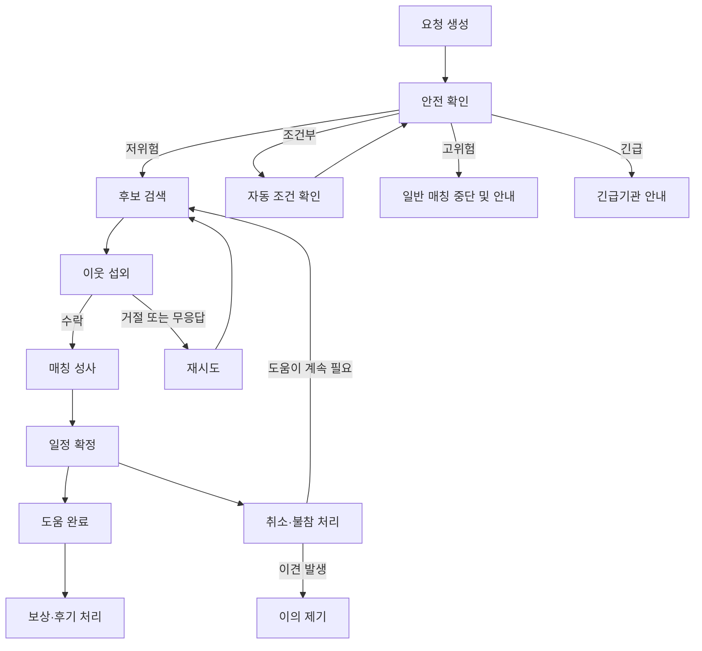

# 30분 교환소  - 지역 돌봄 운영 에이전트

# 30분 교환소

<aside>
🤝

**지역 돌봄 운영 에이전트.**
한 번의 자연어 요청을 받아, 태스크화·안전 판단·이웃 섭외·일정 조율·대체안 제시까지 자율 수행함.

</aside>

## 핵심 문제

- 도움이 필요한 사람의 막연한 사연을 실행 가능한 요청으로 바꾸기 어려움.
- 도움을 줄 수 있는 이웃의 시간·거리·경험·신뢰도를 직접 확인하기 어려움.
- 기존 매칭 서비스에서 발생하는 거절·무응답·일정 충돌을 사용자가 계속 처리해야 함.
- 작은 도움을 안전하게 주고받는 지역 돌봄 운영 구조의 부재.

## 해결 방식

> **“장보기가 어려워요”라는 한 문장을, 실제로 완료되는 지역 돌봄으로 전환하는 에이전트.**
>
- 자연어 사연과 필수 선택 정보를 한 번에 받아 실행 조건을 구조화하는 에이전트.
- 요청을 시간·장소·필요 역량·위험도 단위의 작은 태스크로 분해하는 에이전트.
- 이웃의 가용 시간·거리·경험·신뢰도를 검색하는 에이전트.
- 후보별로 맞춤형 섭외 메시지를 발송하고 응답을 추적하는 에이전트.
- 거절·무응답 발생 시 대체 후보를 다시 탐색하고 재섭외하는 에이전트.
- 매칭 성사 후 일정·안전 안내·시간 크레딧을 자동 처리하는 에이전트.

## 사용자 입력 예시

> “내일 수술 퇴원 후 이틀 동안 반려견 산책과 약 수령 도움이 필요해요.”
>

## 최초 입력 구성

사용자는 필수 선택 사항과 자연어 설명을 하나의 요청으로 한 번만 제출하며, 에이전트 실행 중에는 추가 입력을 요구하지 않는다.

| 항목 | 입력 방식 | 내용 |
| --- | --- | --- |
| 도움 요청 | 주관식·필수 | 필요한 도움을 자연어로 작성. |
| 희망 시간 | 날짜·시간 범위 | 가능한 시간대를 입력. |
| 시간 조정 | 객관식 | 가능 / 불가능. |
| 활동 지역 | 지역 선택·필수 | 기본 동네 또는 다른 지역을 선택하고 대략적인 위치 입력. |
| 비용 발생 | 객관식 | 없음 / 있음 / 모름. |
| 결제 방식 | 조건부 객관식 | 사전 결제 / 요청자 온라인 결제 / 요청자 현장 직접 결제. |
| 추가 사항 | 주관식·선택 | 접근성, 반려동물 특성, 주의사항 등을 입력. |

- 도움 제공자의 선결제와 현금 대리는 허용하지 않음.
- 필수 안전 정보를 확인할 수 없는 태스크만 보류하고, 나머지 태스크는 계속 실행.
- 정확한 주소와 연락처는 최초 요청에 포함하더라도 매칭 확정 전까지 후보에게 공개하지 않음.

## 에이전트 실행 계획 예시

1. **요청 해석.** 퇴원 후 이틀, 약 수령 1회, 반려견 산책 2회로 요구사항 파악.
2. **태스크 분해.** 약 수령 30분 1건, 반려견 산책 30분 2건으로 분리.
3. **안전 분류.** 반려견 산책은 저위험 태스크로 분류하고, 약 수령은 본인 확인·비용 결제·보관 조건을 자동 확인하는 조건부 태스크로 분류.
4. **정보 충분성 판단.** 최초 입력과 사용 가능한 도구로 조건을 확인하고, 필수 정보가 부족한 태스크만 보류.
5. **후보 탐색.** 가용 시간·거리·관련 경험·약속 준수 이력을 기준으로 후보 검색.
6. **맞춤 섭외.** 우선순위가 높은 후보부터 개별 메시지를 발송하고 응답 추적.
7. **응답 감시.** 거절·무응답 발생 시 다음 후보를 탐색하고, 후보 소진 시 대체 시간이나 축소된 도움 범위 제안.
8. **매칭 확정.** 양측 일정과 주의사항을 정리하고 의뢰 전용 채팅방을 생성해 시스템 메시지로 안내.
9. **완료 처리.** 상호 완료 확인 후 가상 시간 크레딧, 온기 여정, 후기와 성공 의뢰 내역 갱신.

## 지역 기반 후보 탐색

- 프로필의 `기본 동네`와 의뢰마다 설정하는 `활동 지역`을 분리해, 본인이나 가족이 다른 지역에서 도움을 요청할 수 있도록 함.
- 도움 제공자는 지도에서 `활동 중심점`을 선택하고 1km·3km·5km 중 활동 반경을 설정.
- 정확한 집 주소 대신 학교·직장·생활권 등 대략적인 활동 중심점을 등록.
- 최소 기능 제품에서는 활동 중심점과 반경을 각각 하나만 등록하고, 여러 활동 지역과 시간대별 설정은 추후 확장.
- 의뢰 장소가 도움 제공자의 활동 반경 안에 있을 때만 후보군에 포함한 뒤, 가용 시간·거리·경험·약속 준수 이력으로 순위를 계산.
- 지도 구현이 늦어지면 지역명 선택과 반경 버튼으로 대체하되, 좌표·거리 기반 후보 필터링은 유지.

## 자율 실행 흐름

아래 흐름은 요청 전체가 아니라 분해된 개별 태스크마다 적용한다.

- 섭외 응답은 `응답 대기 → 수락 / 거절 / 시간 초과 / 취소`로 전환.
- 조건부 태스크는 최초 입력과 도구로 자동 확인하고, 필수 조건을 확인할 수 없으면 해당 태스크만 보류.
- 후보당 가상 시간 10분을 기다리고, 최대 3명까지 재섭외한 뒤 대체 시간이나 요청 범위 조정을 제안.
- 여러 태스크의 결과를 합쳐 요청 전체를 `전체 성사`, `부분 성사`, `안전상 매칭 제외`, `미성사`로 표시.

## 에이전트 개발 도구 구성

에이전트 개발 도구는 여러 에이전트와 도구 호출을 하나의 실행 흐름으로 연결한다.

| 구성 요소 | 역할 |
| --- | --- |
| 총괄 조정 에이전트 | 요청 접수, 태스크 계획, 전체 조율, API 연동. |
| 안전 정책 모듈 | 구조화된 안전 규칙 적용과 고위험 요청의 일반 매칭 중단 판단. |
| 후보 검색 도구 | 활동 중심점과 반경으로 후보를 제한하고, 가용 시간·거리·경험·약속 준수 이력 기반 순위화. |
| 섭외 도구 | 섭외 전송, 응답 상태, 매칭 후 가상 채팅방 상태 처리. |
| 보상 도구 | 완료 시 가상 크레딧, 온기 여정, 후기 상태 갱신. |
| 응답 시뮬레이터 | 시나리오와 응답 정책을 바탕으로 수락·거절·무응답 결정. |
| 시뮬레이션 스케줄러 | 가상 시계 관리, 시간 진행·시간 초과 이벤트 발행. |

- 대규모 언어 모델은 요청 해석·계획과 응답 문구 생성에만 사용.
- 이웃의 응답 결과는 고정 시드, 시나리오, 결정론적 응답 정책으로 결정.
- 데모 후보 순위는 `가용 시간 40% + 거리 25% + 관련 경험 20% + 약속 준수 이력 15%`로 계산하고 근거를 화면에 표시.

## 안전 판단 기준

- **저위험.** 일반 이웃과 바로 매칭할 수 있는 요청.
- **조건부.** 비용·신분 확인·물품 특성 등을 최초 입력과 도구로 자동 확인한 뒤 진행할 수 있는 요청.
- **고위험.** 의료행위·현금 대리·아동 단독 돌봄처럼 일반 이웃 매칭에서 제외하고 안전 안내만 제공할 요청.
- **긴급.** 즉각적인 위험이 의심되면 매칭을 중단하고 긴급기관 이용을 안내할 요청.
- 위험한 태스크만 중단하며, 같은 요청에 포함된 안전한 태스크는 계속 진행.

## 보상과 신뢰 구조

보상은 실용적인 `시간 크레딧`, 정서적인 `온기 여정`, 안전을 위한 `신뢰 정보`로 분리한다.

### 시간 크레딧

- 30분 도움 완료 시 30분 시간 크레딧 적립.
- 적립한 크레딧을 본인·가족을 위한 도움에 사용하거나 공동체 크레딧으로 기부.
- 온기 여정 승급 시 30분의 보너스 크레딧을 한 번만 지급.
- 신규·취약 사용자는 기본 크레딧이나 기부된 공동체 크레딧으로 첫 도움 요청 가능.
- 크레딧은 현금으로 환전하거나 사용자 간에 판매할 수 없음.
- 데모에서는 실제 정산 없이 `지급 대기`, `지급 완료`, `분쟁`의 가상 장부 상태만 변경.

### 온기 여정

- 기여 단계를 `첫걸음 → 따뜻한 이웃 → 든든한 이웃 → 마을지기 → 동네의 별`로 구성.
- 데모 기준으로 완료 1회·3회·10회·25회·50회마다 다음 단계로 승급.
- 요청자와 도움 제공자가 모두 완료를 확인한 도움만 누적 횟수와 도움 시간에 반영.
- 완료 직후 적립 크레딧, 누적 도움 시간, 다음 단계까지의 진행도, 감사 메시지를 함께 표시.
- 공개 순위나 연속 출석은 운영하지 않고, 참여가 끊겨도 단계가 내려가지 않음.
- 위험하거나 어려운 요청에 더 많은 점수를 주지 않아 무리한 참여를 유도하지 않음.

### 신뢰 정보

- 기여 단계와 신뢰 정보를 분리하고, 높은 기여 단계가 전문성이나 안전을 보장하는 것으로 표현하지 않음.
- 단일 신뢰 점수 대신 약속 준수, 완료 이력, 관련 경험, 본인 확인 여부를 구분해 표시.
- 신규 참여자는 저위험·비대면 태스크부터 연결하고, 완료 이력이 쌓이면 참여 범위를 단계적으로 확대.
- 취소·불참 처리에 이견이 있으면 이의 제기 상태로 전환하고 크레딧 지급을 보류.
- 고위험 요청은 일반 이웃 매칭에서 제외하고, 데모에서는 중단 사유와 안전 안내만 표시.
- 고위험 요청에 대한 실제 기관 연동이나 별도 제공자 연결은 이번 해커톤에서 보류하고 구현 범위에서 제외.

### 성공 의뢰 내역

- 성공한 의뢰를 `우리 동네에 해결된 도움`으로 공개해 공동체의 활동과 실제 임팩트를 보여줌.
- 동네 범위, 도움 유형, 소요 시간, 결과, 익명 감사 메시지만 표시.
- 이름, 상세 주소, 연락처, 의료 정보는 공개하지 않으며 양측이 동의한 의뢰만 게시.
- 공개에 동의하지 않은 의뢰는 개인의 누적 기여에만 반영하고 공개 목록에서는 제외.

## 개인정보와 사용자 통제

- 사용자는 최초 요청을 제출하기 전까지 내용을 수정할 수 있으며, 에이전트 실행 중에는 추가 입력을 요구하지 않음.
- 후보에게는 대략적인 거리와 시간만 먼저 공개하고, 상세 주소와 연락처는 매칭 확정 및 사용자 동의 후 공개.
- 취소된 매칭의 연락 수단은 다시 노출하지 않으며, 부적절한 행동을 신고·차단할 수 있도록 설계.
- 성공 의뢰 내역 공개 여부는 요청자와 도움 제공자가 각각 선택할 수 있음.
- 데모의 사용자·이웃·연락처 데이터는 모두 가상 정보임을 화면에 표시.

## 매칭 후 채팅과 연락처

- 매칭이 확정되면 해당 의뢰 전용 앱 내 채팅방을 자동 생성.
- 채팅방 첫 메시지로 태스크, 일정, 대략적인 장소, 주의사항, 완료·취소 방법을 자동 안내.
- 정확한 장소는 구조화된 위치 공유 기능으로 전달하고, 일반 채팅에 불필요한 개인정보를 입력하지 않도록 안내.
- 채팅은 매칭 이후의 후속 조율 수단이며, 에이전트가 최종 결과를 내기 위해 사람의 답장을 기다리지 않음.
- 최소 기능 제품에서는 실제 메시지 송수신 없이 가상 채팅방과 준비된 메시지를 보여주고 화면에 `시뮬레이션`이라고 표시.
- 신고·차단·완료 확인 상태를 제공하고 완료 또는 취소된 채팅방은 읽기 전용으로 전환.
- 연락처 교환은 양측이 모두 동의했을 때만 가능하게 설계하되, 핵심 기능이 완성된 뒤 구현하는 후순위 항목으로 둠.
- 연락처 교환이 구현되지 않아도 앱 내 채팅만으로 전체 흐름이 성립하도록 설계.

## 이벤트 구조

- 상태 전이 구조 확정 후 다음 이벤트 형식을 정의.
- `task_created`: 태스크 생성.
- `safety_checked`: 안전 판단 완료.
- `candidate_found`: 후보 검색 완료.
- `outreach_sent`: 섭외 메시지 발송.
- `neighbor_replied`: 이웃 응답 수신.
- `clock_tick`: 가상 시계 진행.
- `outreach_timed_out`: 섭외 응답 시간 초과.
- `match_confirmed`: 매칭 확정.
- `task_blocked`: 고위험 태스크 일반 매칭 중단.
- `plan_updated`: 실행 계획 갱신.

## 라이브 데모 구성

### 프론트

- 왼쪽에 사용자 요청과 최종 결과 표시.
- 가운데에 태스크 상태와 후보 섭외 현황 표시.
- 오른쪽에 실시간 이벤트 흐름과 가상 시계 표시.
- 지도, 보상 카드, 성공 의뢰 목록, 채팅방은 핵심 화면이 안정화된 뒤 디테일 백로그에서 선택해 추가.

### 에이전트 콘솔

- 실시간 모드와 동일한 이벤트 형식을 사용하는 재생 모드 제공.
- 태스크 생성, 안전 판단, 후보 검색, 섭외, 재시도 과정을 실시간으로 노출.
- 모든 시나리오에 고정 시드를 적용해 동일한 결과 재현.

## 데모 시나리오

1. **정상 성사.** 첫 번째 후보와 정상 매칭.
2. **재시도.** 첫 후보 거절, 다음 후보 무응답, 세 번째 후보 수락.
3. **안전 분기.** 안전한 태스크는 매칭하고 위험한 태스크는 일반 매칭을 중단한 뒤 사유 안내.

## 실제 구현과 시뮬레이션 경계

- 요청 해석, 태스크 분해, 안전 판단, 후보 검색, 도구 호출, 거절·무응답 후 재시도는 실제 에이전트 실행으로 구현.
- 실제 메시징, 지도 서비스, 결제, 기관 연동, 신원 인증, 연락처 교환은 시간 부족 시 시뮬레이션으로 대체 가능.
- 시뮬레이션 기능은 화면에서 실제 연동처럼 표현하지 않고 `시뮬레이션`이라고 명확히 표시.
- 시뮬레이션도 실제 기능과 같은 이벤트 형식을 사용해 나중에 구현체만 교체할 수 있도록 설계.
- 심사용 원본 도구 호출·결과 로그는 실제 실행에서 발생한 내용만 출력하고 가짜 로그를 만들지 않음.
- 연락처 교환은 핵심 매칭·재시도·채팅방 흐름이 모두 완성된 경우에만 구현하는 후순위 기능으로 둠.

## 돌발 요청 대응

- 요청을 안전 기준에 따라 태스크 단위로 분리.
- 고위험 태스크는 일반 이웃 매칭을 중단하고 판단 사유와 안전 안내를 표시.
- 안전한 태스크는 일반 이웃 매칭을 계속 진행.
- 최종 결과를 부분 성사와 일부 태스크의 안전상 매칭 제외로 안내.
- 고위험 요청에 대한 실제 기관 연동이나 별도 제공자 연결은 이번 해커톤에서 보류하고 시연하지 않음.

## 심사 포인트

- **실행 흐름 설계.** 요청 이해 → 태스크 분해 → 안전 판단 → 후보 검색 → 섭외 → 예외 대응으로 이어지는 명확한 구조.
- **프롬프트 품질.** 태스크 분해, 안전 기준, 우선순위, 실패 대응을 명시한 프롬프트.
- **실시간 적응력.** 거절·무응답과 고위험 태스크 발생 시 실행 계획을 스스로 조정하는 구조.
- **안전과 신뢰.** 안전한 태스크의 진행을 유지하면서 위험한 태스크만 분리하는 정책.
- **발표 명확성.** 판단 과정과 상태 변화를 실시간으로 보여주는 명확한 데모.

<aside>
🎯

**핵심 피치.** 사람을 추천하는 앱이 아니라, 돌봄 요청이 들어온 순간부터 매칭 성사까지 지역의 운영 업무를 대신 수행하는 자율 에이전트.

</aside>

## 팀 구성

> **A는 시스템의 뼈대, B는 판단 기능, C는 프론트를 담당한다.**

| 담당 | 역할 | 구현 항목 |
| --- | --- | --- |
| A — 실행 뼈대 | 한 번의 요청이 끝까지 실행되는 백엔드 흐름을 구성하고 B와 C를 연결. | 서버, OpenAI 연결, 태스크 상태, 도구 호출, 결과 취합, 이벤트·원본 로그 전달. |
| B — 핵심 판단·검증 | A가 호출할 최소 판단 도구를 구현하고 같은 입력에서 같은 결과가 나오는지 검증. | 최소 가상 데이터, 안전 판단, 후보 검색, 응답 시뮬레이션, 고정 시드, 반복 테스트. |
| C — 최소 프론트 | A와 같은 데이터 형식을 사용해 요청부터 결과까지 핵심 상태를 표시. | 최초 입력, 태스크·후보 상태, 최종 결과, 이벤트, 원본 로그, 재생 화면. |

### 역할 분담 세부

세 담당은 시작과 동시에 병렬로 작업한다. A는 임시 판단 도구, B는 독립 실행 가능한 함수, C는 고정 이벤트 예시를 사용하고 첫 통합에서 임시 부분을 실제 구현으로 교체한다.

#### 병렬 작업을 위한 공통 계약

세 담당은 아래 데이터 형식을 기준으로 바로 시작하고, 필드 변경이 필요하면 중간 점검에서 합의한 뒤 함께 반영한다.

| 데이터 | 필수 내용 |
| --- | --- |
| 최초 요청 | 요청 식별자, 도움 내용, 희망 시간, 활동 지역, 비용·결제 정보, 추가 사항. |
| 태스크 | 태스크 식별자, 제목, 시간, 지역, 필요 경험, 안전 등급, 현재 상태, 부족한 정보. |
| 후보 | 후보 식별자, 거리, 가용 시간, 경험, 약속 준수 이력, 점수, 응답 정책. |
| 이벤트 | 순번, 발생 시각, 이벤트 종류, 태스크 식별자, 표시 문구, 원본 데이터, 시뮬레이션 여부. |
| 최종 결과 | 요청 식별자, 전체 상태, 태스크별 결과, 사용자 안내 문구. |

**B가 제공할 최소 함수**

- `안전 판단(태스크) → 안전 등급·판단 근거·부족한 정보`
- `후보 검색(태스크, 이웃 목록) → 점수순 후보 목록`
- `응답 결정(태스크, 후보, 고정 시드) → 수락·거절·무응답`

**동시 시작 방식**

- A는 위 함수와 같은 입력·출력을 가진 임시 함수를 연결해 전체 실행 흐름부터 작성.
- B는 서버나 프론트를 기다리지 않고 동일한 계약을 따르는 순수 함수와 테스트 작성.
- C는 위 이벤트 형식의 고정 예시 데이터로 요청·진행 상태·결과·원본 로그 화면 작성.
- 첫 통합에서 A의 임시 함수를 B의 실제 함수로 교체하고 C의 고정 데이터를 A의 실시간 이벤트로 교체.
- 통합 전까지 각 담당은 자기 영역 안에서 작업하며 공통 계약을 일방적으로 변경하지 않음.

#### 공통 완료 목표

- [ ] 실제 OpenAI 호출로 요청을 태스크로 분해.
- [ ] 실제 B의 판단 함수를 호출해 후보 1명을 선택.
- [ ] 한 번의 입력으로 정상 성사 결과까지 추가 조작 없이 실행.
- [ ] C가 A의 실제 이벤트와 원본 도구 로그를 같은 순서로 표시.
- [ ] 정상 성사 흐름을 10회 연속 실행해 동일한 입력에서 동일한 결과를 확인.

#### A — 실행 뼈대 담당 에이전트

> 당신의 목표는 최초 요청 한 번으로 정상 성사 결과까지 이어지는 최소 백엔드 흐름을 가장 먼저 연결하는 것이다.

**작업 순서**

- [ ] 프로젝트 실행 환경과 서버 시작 명령 구성.
- [ ] 공통 데이터 형식을 코드로 정의하고 B와 C에 즉시 공유.
- [ ] OpenAI API를 연결해 최초 요청을 실행 가능한 태스크로 분해.
- [ ] B의 세 가지 최소 함수와 같은 계약을 가진 임시 함수를 연결.
- [ ] `요청 생성 → 안전 판단 → 후보 검색 → 응답 결정 → 매칭 결과`의 최소 실행 흐름 구현.
- [ ] 태스크 상태와 요청 전체 결과를 생성.
- [ ] C가 받을 화면용 이벤트와 실제 `tool_call`, `tool_result` 원본 로그 전달.
- [ ] B의 함수가 준비되면 임시 함수를 실제 함수로 교체하고 정상 성사 흐름 반복 실행.

**A의 산출물**

- 실행 가능한 백엔드와 시작 방법.
- 공통 데이터 형식.
- OpenAI 태스크 분해와 최소 실행 흐름.
- B의 판단 함수를 호출하는 연결부.
- C가 받을 이벤트, 원본 로그, 최종 결과.

**A의 완료 조건**

- 최초 요청 한 번으로 정상 성사 결과까지 실행됨.
- B의 실제 함수로 교체한 뒤에도 같은 흐름이 유지됨.
- C가 실제 이벤트와 원본 로그를 순서대로 받을 수 있음.

#### B — 핵심 판단·검증 담당 에이전트

> 당신의 목표는 A가 즉시 연결할 수 있는 최소 판단 함수와 고정 데이터를 만들고, 전체 뼈대가 반복 실행에서도 흔들리지 않도록 검증하는 것이다.

**작업 순서**

- [ ] 공통 계약을 따르는 최소 가상 이웃 3명과 정상 성사 입력 작성.
- [ ] `안전 판단`, `후보 검색`, `응답 결정` 세 함수를 서버와 무관하게 실행 가능하도록 구현.
- [ ] 후보 검색은 먼저 단순한 거리·가용 시간·경험 기준으로 결정론적으로 정렬.
- [ ] 응답 결정은 고정 시드에서 항상 같은 수락 결과를 반환하도록 구현.
- [ ] 각 함수에 고정 입력·출력 예시와 단위 테스트 작성.
- [ ] A가 실제 함수를 연결하면 정상 성사 흐름을 함께 반복 실행하고 데이터 형식 불일치를 수정.
- [ ] 정상 성사 흐름이 안정된 뒤에만 거절·무응답, 고위험, 부분 성사 데이터를 추가.

**B의 산출물**

- 최소 가상 이웃과 정상 성사 데이터.
- 세 가지 최소 판단 함수.
- 고정 입력·출력 예시와 단위 테스트.
- 통합 반복 실행 결과.

**B의 완료 조건**

- A가 별도 변환 없이 세 함수를 호출할 수 있음.
- 같은 입력과 고정 시드에서 후보 순서와 응답 결과가 항상 동일함.
- 정상 성사 흐름을 10회 반복해도 결과가 달라지지 않음.

#### C — 최소 프론트 담당 에이전트

> 당신의 목표는 고정 이벤트 예시로 먼저 화면을 만들고, 첫 통합에서 A의 실제 이벤트로 교체해 전체 실행 상태를 끊김 없이 보여주는 것이다.

**작업 순서**

- [ ] 공통 계약을 따르는 고정 이벤트 예시를 먼저 작성.
- [ ] 도움 내용과 필수 조건을 한 번에 제출하는 최소 입력 폼 구현.
- [ ] 태스크, 현재 상태, 선택된 후보, 최종 결과를 표시하는 단순 화면 구현.
- [ ] 화면용 이벤트와 실제 `tool_call`, `tool_result` 원본 로그를 구분해 표시.
- [ ] 고정 이벤트 예시를 같은 순서로 재생할 수 있게 구현.
- [ ] A의 이벤트 연결이 준비되면 데이터 공급원만 교체하고 같은 화면에서 실제 실행 확인.
- [ ] 정상 성사 흐름이 안정된 뒤에만 거절·무응답, 고위험, 부분 성사 표시를 추가.

**C의 산출물**

- 최소 입력 폼.
- 태스크·후보·상태·최종 결과 화면.
- 화면용 이벤트와 원본 도구 로그 화면.
- 고정 이벤트 재생과 실제 이벤트 연결.

**C의 완료 조건**

- A를 기다리지 않고 고정 이벤트로 화면을 완성할 수 있음.
- A의 실제 이벤트로 교체해도 컴포넌트를 다시 작성하지 않음.
- 한 번 제출한 뒤 정상 성사 결과까지 추가 조작 없이 표시됨.

### 협업 원칙

- 세 명은 공통 계약을 읽은 직후 동시에 작업을 시작하고, 다른 담당의 구현 완료를 기다리지 않음.
- A는 임시 판단 함수, B는 독립 테스트, C는 고정 이벤트를 사용해 각자의 첫 결과물을 만듦.
- 첫 점검에서는 기능 완성도가 아니라 데이터 형식과 연결 가능 여부만 확인.
- 첫 통합에서 A의 임시 함수를 B의 실제 함수로, C의 고정 이벤트를 A의 실제 이벤트로 교체.
- 공통 계약 변경은 세 명이 합의한 경우에만 진행하고, 변경한 담당자가 예시 데이터와 테스트도 함께 수정.
- 통합이 깨지면 새로운 기능을 중단하고 해당 경계의 두 담당자가 함께 수정.
- 정상 성사 흐름을 10회 연속 통과한 뒤 거절·무응답, 안전 분기, 부분 성사를 순서대로 추가.

### 중간 조정 시점

| 시점 | 함께 확인할 내용 | 조정 결과 |
| --- | --- | --- |
| 시작 직후 | 공통 계약, 실행 명령, 담당 영역. | 각자 독립 작업 시작. |
| T+1h | A의 임시 함수, B의 함수 예시, C의 고정 이벤트가 같은 형식인지 확인. | 필드 이름과 상태값 통일. |
| T+3h | 각 담당의 최소 산출물이 단독으로 실행되는지 확인. | 첫 통합을 막는 문제만 수정. |
| T+6h | 실제 B 함수와 A 실행 흐름, C 화면을 처음 연결. | 정상 성사 흐름 완성. |
| T+9h | 정상 성사 흐름 10회 반복. | 오류·순서·상태 불일치 수정 후 계약 동결. |
| 이후 3시간마다 | 전체 흐름과 새로 추가한 분기 회귀 테스트. | 통과한 기능만 유지하고 실패한 기능은 되돌리거나 보류. |

## 디테일 백로그

아래 기능은 담당자를 미리 정하지 않는다. 정상 성사·재시도·안전 분기·부분 성사와 재생 모드가 안정화된 뒤, 남는 시간과 각자의 진행 상황에 따라 한 명씩 가져간다.

### 지역·프론트 디테일

- [ ] 실제 지도 연동.
- [ ] 지도 핀 이동과 활동 반경 원 표시.
- [ ] 여러 활동 지역과 시간대별 활동 범위.
- [ ] 모바일 화면과 상태 전환 애니메이션.

### 보상·커뮤니티 디테일

- [ ] 시간 크레딧 장부와 승급 보너스.
- [ ] 온기 여정 단계와 보상 카드.
- [ ] 익명 감사 메시지와 성공 의뢰 공개 목록.
- [ ] 공동체 크레딧 기부와 신규 사용자 기본 크레딧.

### 소통 디테일

- [ ] 매칭 후 가상 채팅방과 시스템 메시지.
- [ ] 신고·차단·완료 확인과 채팅방 종료 상태.
- [ ] 실제 채팅 연동.
- [ ] 양측 동의 기반 연락처 교환은 가장 마지막에 검토.

### 데이터·정책 디테일

- [ ] 가상 이웃을 20명 이상으로 확대.
- [ ] 후보 점수 근거와 동점 처리 고도화.
- [ ] 조건부 요청의 세부 안전 규칙 확대.
- [ ] 개인정보 마스킹과 공개 동의 흐름 고도화.

### 백로그 작업 규칙

- 작업을 가져가기 전에 팀에 담당 기능과 예상 시간을 공유해 중복 작업을 방지.
- 한 번에 한 항목만 맡고, 가능하면 60~90분 안에 독립적으로 끝낼 수 있는 크기로 나눔.
- 공통 계약을 바꾸지 않고 붙일 수 있는 기능부터 선택.
- 핵심 흐름이나 원본 로그가 깨지면 디테일 작업을 즉시 중단하고 안정 버전으로 복구.
- 시간이 부족하면 완료하지 못한 디테일은 삭제하거나 `시뮬레이션`으로 명확히 표시.

## 24시간 실행 계획

| 시간 | 목표 |
| --- | --- |
| T+1h | 공통 계약 확인 후 A·B·C 병렬 작업 시작. |
| T+3h | 세 담당의 최소 산출물 단독 실행 확인. |
| T+6h | 실제 판단 함수·실행 흐름·프론트를 연결한 정상 성사 흐름 완성. |
| T+9h | 정상 성사 흐름 10회 반복, 오류 수정, 공통 계약 동결. |
| T+13h | 안전 판단, 지역·반경 후보 필터, 거절·무응답·재섭외 완성. |
| T+16h | 부분 성사, 고위험 차단·안내, 재생 모드와 예비 이벤트 완성. |
| T+18h | 핵심 기능 동결과 전체 회귀 테스트. |
| T+20h | 안정 상태를 유지할 수 있는 범위에서 디테일 백로그 선택 구현. |
| T+24h | 돌발 입력 테스트, 리허설, 버그 수정. |

## 최소 기능 제품 범위

핵심 가치가 실제로 작동하는지 보여주기 위해 반드시 구현할 최소 범위다.

- 필수 선택 사항과 자연어 설명을 한 번에 제출하고 태스크로 분해.
- 지역명과 활동 반경을 이용한 기본 후보 필터.
- 안전 정책 기반 태스크별 판정.
- 후보 검색과 결정론적 응답 시뮬레이션.
- 거절·무응답 후 재섭외.
- 실시간 이벤트와 실제 원본 도구 로그.
- 부분 성사와 고위험 요청 차단·안내.
- 고정 시드와 재생 모드.
- 오류 발생 시 사용할 예비 이벤트 흐름.
- 보상, 성공 의뢰 공개, 지도, 채팅, 연락처 교환은 핵심 안정화 이후 디테일 백로그에서 선택.
- 실제 메시징, 기관 연동, 신원 인증, 결제·외부 정산은 구현하지 않고 필요 시 시뮬레이션으로 표시.
